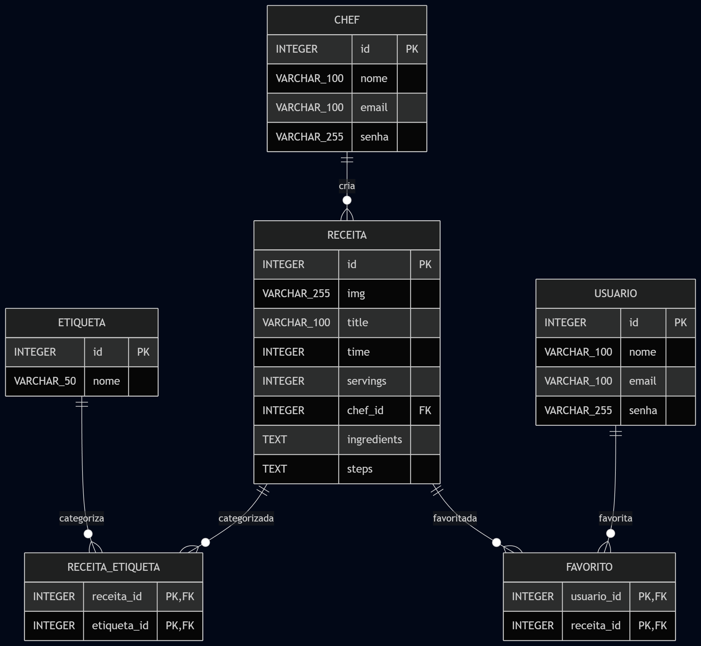

# Receitoteca 👨‍🍳

Receitoteca é uma aplicação web para descoberta e compartilhamento de receitas culinárias.

## Sobre o projeto

A plataforma conecta dois tipos de usuários: **chefs**, que publicam e gerenciam suas próprias receitas, e **entusiastas**, que exploram o catálogo e salvam seus favoritos. Cada receita pode receber múltiplas etiquetas de classificação — como Salgada, Vegana ou Low Carb — e é vinculada ao chef que a criou.

### Página Inicial

[Acesse a página inicial](https://marcosemive.github.io/Receitoteca/public/paginainicial.html)

### Modelagem de Dados



## Tecnologias

* Node.js + Express.js
* TypeScript
* Prisma ORM + SQLite
* JWT para autenticação
* HTML/CSS/JavaScript (vanilla) no front-end, com Tailwind CSS para estilização complementar

## Como executar o projeto

### Pré-requisitos

* Node.js 18+

### 1. Clonar o repositório

```bash
git clone https://github.com/marcosemive/Receitoteca.git
cd Receitoteca
```

### 2. Instalar dependências

```bash
npm install
```

### 3. Gerar o Prisma Client

```bash
npx prisma generate
```

### 4. Configurar variáveis de ambiente

Copie o arquivo de exemplo e ajuste se necessário:

```bash
cp .env.example .env
```

### 5. Criar e popular o banco de dados

```bash
npm run db:refresh
```

Esse comando apaga o banco existente, aplica as migrations do Prisma e popula com dados iniciais de teste (chefs, etiquetas e receitas de exemplo).

### 6. Rodar o servidor

```bash
npm run dev
```

A aplicação estará disponível em `http://localhost:3000`.

> Ou rode tudo de uma vez com `npm run dev:all` (recria o banco e já sobe o servidor).

## Ambiente de desenvolvimento (Dev Container)

O projeto inclui uma configuração de Dev Container que instala automaticamente as extensões do VSCode necessárias para o desenvolvimento:

* **Prisma** — syntax highlighting e autocomplete para `schema.prisma`
* **REST Client** — execução das requisições do arquivo `request.http`
* **SQLite Viewer** — visualização do banco `dev.db` diretamente no editor
* **ESLint** e **Prettier** — padronização de código

Ao abrir o projeto no GitHub Codespaces ou em um Dev Container local, essas extensões são instaladas automaticamente.

## Estrutura do projeto

```
src/
├── controllers/    # Regras de negócio e tratamento de requisições
├── models/         # Acesso ao banco via Prisma Client
├── routes/         # Definição das rotas da API
├── middlewares/     # Autenticação, validação, tratamento de erros
├── database/        # Configuração do Prisma Client e seed
public/               # Front-end (HTML, CSS, JS)
prisma/
├── schema.prisma     # Modelagem do banco
├── migrations/        # Histórico de migrations
```

## Testando a API

O arquivo `request.http` na raiz do projeto contém exemplos de requisições para todas as rotas (autenticação, CRUD de receitas, favoritos, upload), incluindo casos de erro. Pode ser executado com a extensão REST Client do VSCode.

## Usuários de teste (gerados pelo seed)

| Tipo       | E-mail                                                | Senha     |
| ---------- | ----------------------------------------------------- | --------- |
| Chef       | [paulo@receitoteca.com](mailto:paulo@receitoteca.com) | Paulo@123 |
| Entusiasta | [ana@receitoteca.com](mailto:ana@receitoteca.com)     | Ana@1234  |
