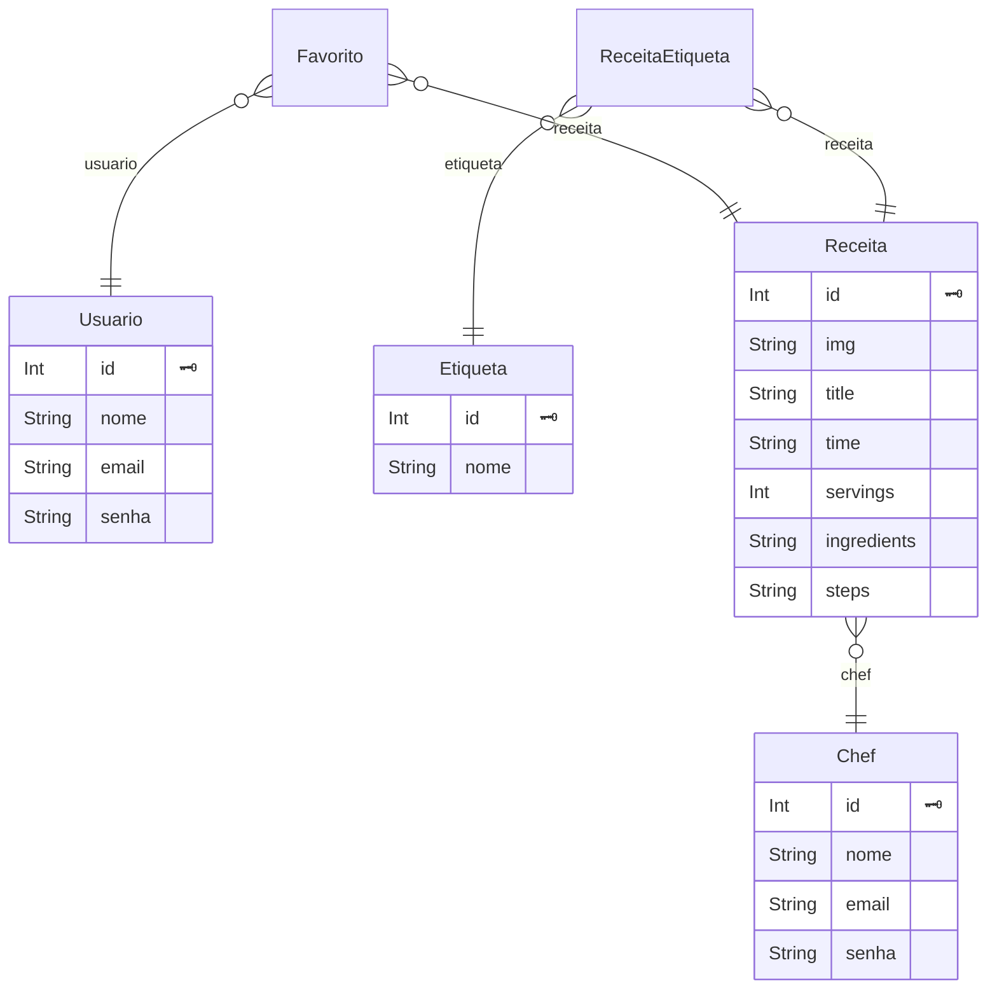

```mermaid
erDiagram

  "Chef" {
    Int id "🗝️"
    String nome 
    String email 
    String senha 
    }
  

  "Usuario" {
    Int id "🗝️"
    String nome 
    String email 
    String senha 
    }
  

  "Etiqueta" {
    Int id "🗝️"
    String nome 
    }
  

  "Receita" {
    Int id "🗝️"
    String img 
    String title 
    String time 
    Int servings 
    String ingredients 
    String steps 
    }
  

  "ReceitaEtiqueta" {

    }
  

  "Favorito" {

    }
  
    "Receita" }o--|| "Chef" : "chef"
    "ReceitaEtiqueta" }o--|| "Receita" : "receita"
    "ReceitaEtiqueta" }o--|| "Etiqueta" : "etiqueta"
    "Favorito" }o--|| "Usuario" : "usuario"
    "Favorito" }o--|| "Receita" : "receita"
```
